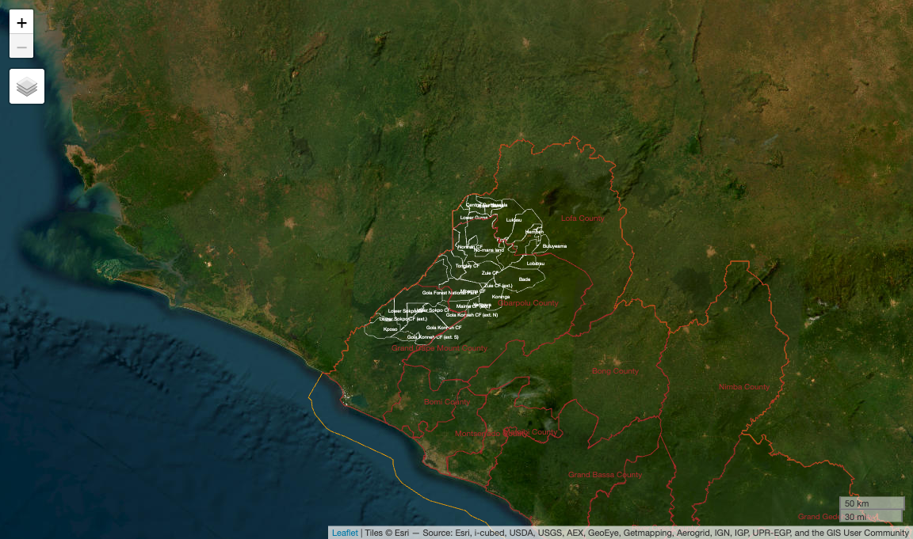
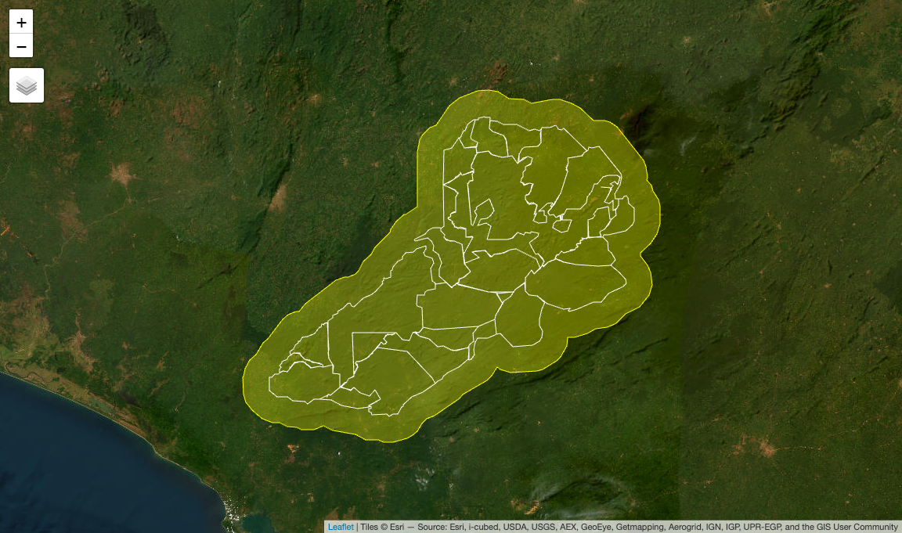
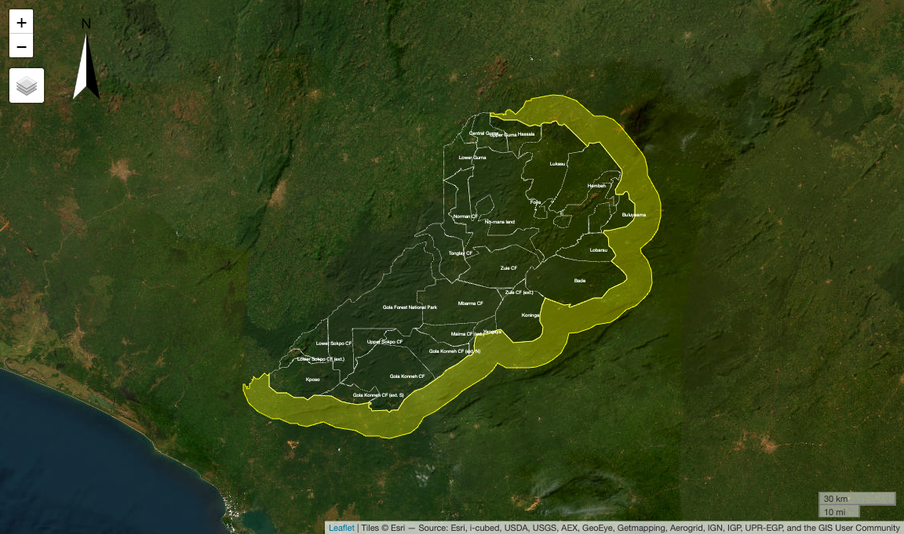
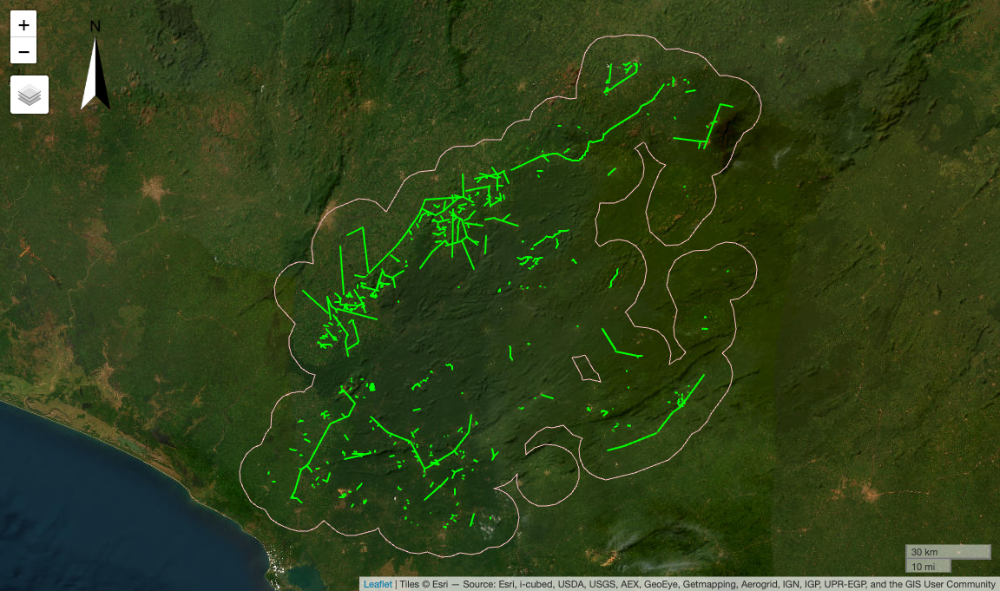
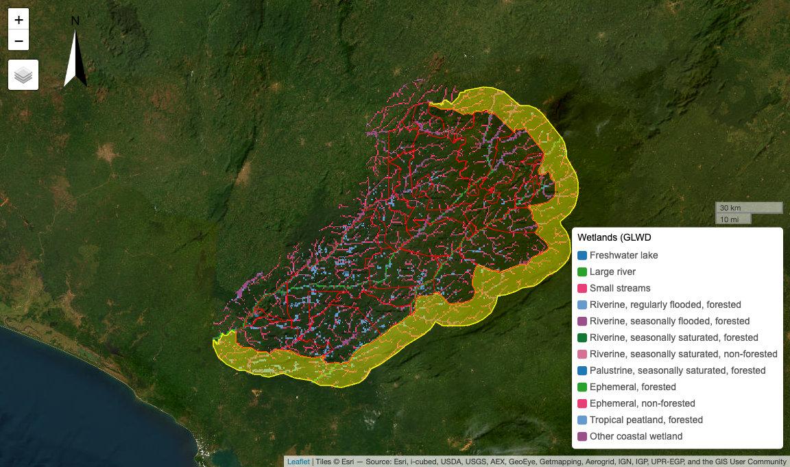
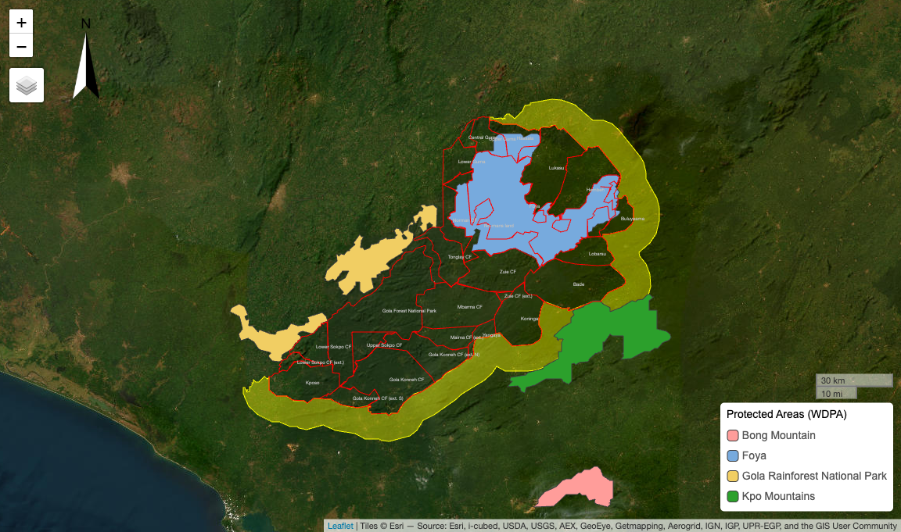
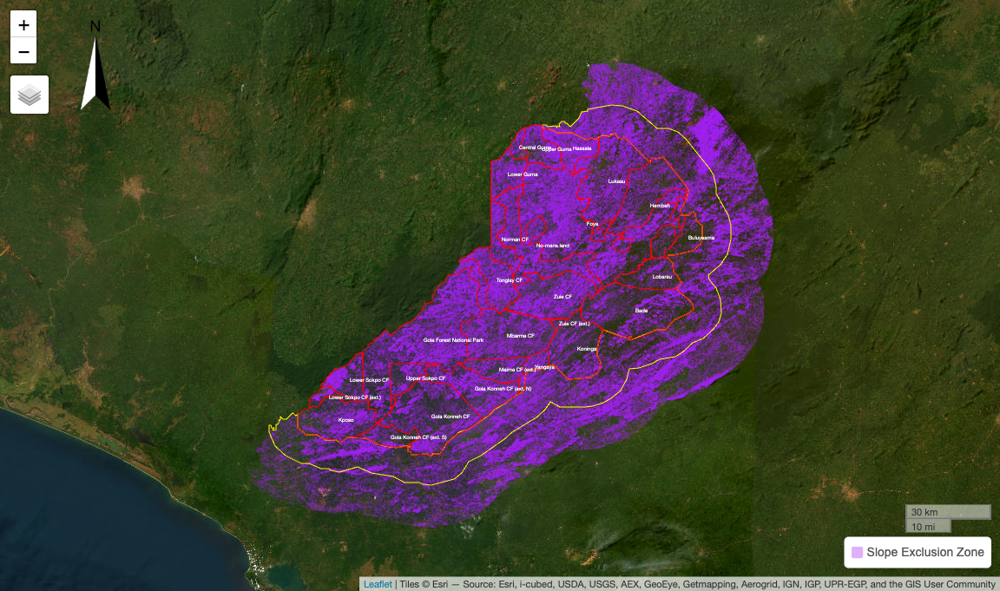
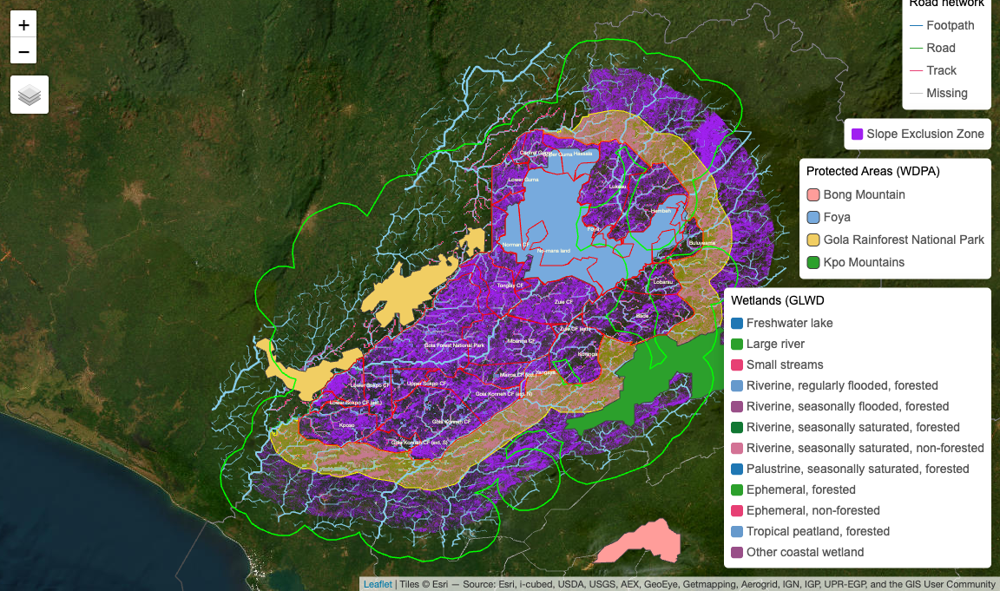
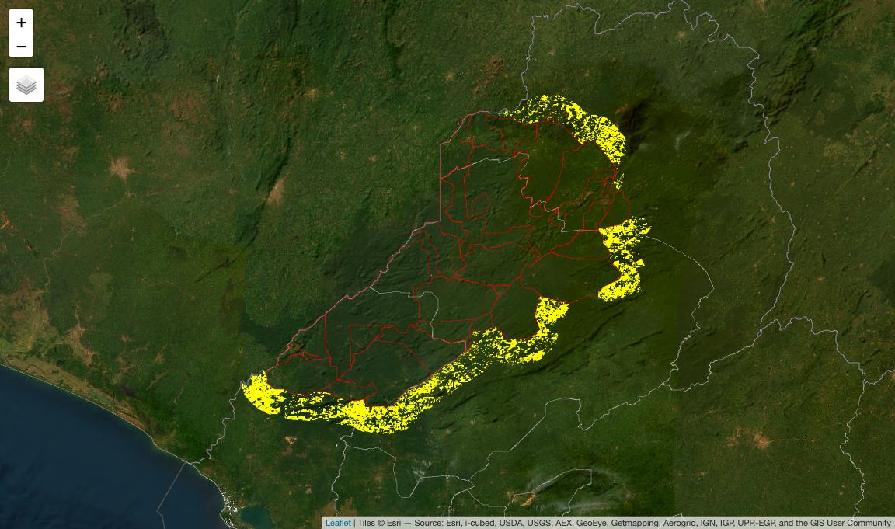

Leakage Belt Delineation
================
truetruetruetrue
2025-05-19

- [Objective:](#objective)
  - [Project Boundaries](#project-boundaries)
  - [Derive Leakage Belt](#derive-leakage-belt)
  - [Derive Leakage Masks](#derive-leakage-masks)
  - [Apply Leakage Masks](#apply-leakage-masks)
  - [Tally Leakage Area Features](#tally-leakage-area-features)

<!-- TOC HTML ELEMENTS -->

<input type="button" class="d-article-with-toc" id="TOC" value="&#x2630" title="Toggle (Hide/Show) Table of Contents" alt="Toggle button for hiding/showing the Table of Contents" onclick="toggle()" style="padding:7px; border: 0px;"/>

<style type="text/css">
div.column {
    display: inline-block;
    vertical-align: top;
    width: 80%;
}
&#10;#TOC::before {
  content: "";
  display: block;
  height: 60px;
  width: 200px;
  background-image: url(https://winrock.org/wp-content/uploads/2021/12/Winrock-logo-R.png);
  background-size: contain;
  background-position: centre;
  padding-top: 50px !important;
  background-repeat: no-repeat;
}
</style>

## Objective:

This report outlines the geospatial methodology implemented to delineate
a VMD0055-compliant leakage belt for the Gola REDD+ Forest Carbon
Project in Liberia. The work was conducted as part of the larger REDD+
feasibility assessment work aiming to inform the development and
submission of a project proposal that aligns with Verra’s VM0048 project
framework.[^1] Considering these directives and their future timelines,
the following aimed to provide procedural guidelines for replicating
this analysis and meeting the VM0048 standard. This included an overview
of data sources reviewed and their qualifying criteria, methodological
recommendations for documenting data processing tasks and reporting
accuracy and performance metrics. Following this, we provide a summary
of the project’s revised area estimates. In effect, as a result of
recent area expansions into nearby community forests, the project’s
total conservation zone increased by a factor of 6.04.

The project’s expansion necessitated identifying potential zones where
deforestation pressures might shift due to enhanced conservation
measures. We delineated a leakage belt from surrounding forestland
meeting eligibility criteria defined in VM0048 and VMD0055 guidelines.
These criteria include topographical constraints (slope gradients),
anthropogenic factors (proximity to roads and settlements), and
ecological considerations (excluding protected areas and wetlands), all
aimed at ensuring the leakage area represents forests at risk of shifted
deforestation rather than areas that would not normally face such
pressures.

### Project Boundaries

#### Data imports:

- Imported the Liberia national boundary and county shapefiles.[^2]

  Filtered counties to select the Grand Cape Mount and Gharpolu
  jurisdictions, relevant for the REDD+ project area.

#### Data processing:

- A project coordinate system was declared as the EPSG:32629[^3]
  projected reference system, encouraging best practices, while matching
  package requirements and avoiding delays in shapefile processing
  downstream.

- Spatial data validation was performed prior to area quantification to
  scan for geometry errors potentially significant to two-dimensional
  measurements. We follow good practice when dealing with new
  shapefiles, or rather old shapefiles with longer lifespans and more
  extensive revisions, that tend to involve orphoned artifacts, topology
  errors, or schema issues affect compromising our

  - We checked for schema conformity and domain consistency, relational
    fields, and potential for vertical integration. The check reviewed
    internal rules, file naming conventions, data types and value
    ranges.

  - Referencing OGC Standard (ISO, 2019),[^4] we conducted topology
    checks on polygonal structure, nodal architecture, and linework.
    From our screening, we identified 138 geometry violations, including
    overlapping polygon borders, un-noded intersections, few gaps from
    unclosed polygon rings, and a majority of smaller orphans in the
    form of banana polyons, self-touching holes, inverted shells, and
    dangling nodes. Invalid polygons, linestrings and point objects were
    extracted incrementally using the following three algorithms:

- `simplifyCoverageVW()`The Visvalingam–Whyatt Simplificationalgorithm
  was deployed to address overlapping coverage of bordering polygons by
  eliminating unnecessary vertices and reducing edge complexity.

- `hausdorffDistance()` The Hausdorff Distance function was employed in
  similar areas but to address problematic linework, by measuring the
  geometric similarity between polygon edges and target geometries,
  highlighting polygon borders with broken linework, and manually
  aligning using the snapping tool.

- `geos::maximumInscribedCircle()` The Maximum Inscribed Circle
  algorithm is useful for locating floating artifact strips. This
  function can be used to characterizing polygons and all underlying
  holes according to dimensions of their internal narrowness. With this
  metric, we can classify valid polygons from invalid slivers before
  dropping them from the dataset.

- `sf::st_intersection()` A personal favorite of mine, we applied the
  `st_intersection()` function which is known for it use in geometry
  overlays and more commonly clipping operations. The function
  effectively decomposes and exposes objects with overlapping, nested,
  or self-intersecting geometries. However, we must note some key
  methodological differences to other conventional decomposition
  functions. Notably, the `st_intersection()` function and its vertex
  indexing was instrumental in surfacing the hidden slivers, embedded
  nodes, and unindexed artifacts of 100ha or less, which had otherwise
  eluded `cast()` and conventional decomposition functions due to their
  metrics and variables being derived from polygonal structure instead
  of linework. For interested users, options for deploying both
  “valid_linework” or “valid_structure” functions are available in
  `sf::st_make_valid(geos_method="valid_structure")` operations. When
  clipping is turned off, and only one object is inputted, the
  `st_intersection()` function instead splits all internal overlaps into
  non-overlapping components while also assigning two new attributes of
  `n.overlaps()` and `origins` recording how many features contribute to
  each intersection. With this vertex score, the function can
  efficiently perform pairwise geometric comparisons across larger
  shapefiles. However, perhaps most impressive is how the
  `st_intersection()` effectively exposes all overlaps, segments all
  invalid geometries: and assigns a vertex-based index that enables easy
  extraction, recovery, or reclassification of geometry errors, all of
  which was achieved by explicitly assigning self-intersections to the
  features domain. Lastly, if users prefer to quickly discard all errors
  and skip geometry inspections, then the `st_difference` function may
  be more suitable

- Area Calculation:

  - Computed total hectares of project sites.
  - Final area estimates were reported below which yielded a total
    project footprint of 769,050 ha in the newest expansion.

``` r
country = sf::read_sf("/Users/seamus/Library/CloudStorage/OneDrive-WinrockInternationalInstituteforAgriculturalDevelopment/20087 - RSPB Gola Feasibility/Deliverables/Spatial Data/AOI/Archive/Liberia-National-Border/liberia_boundary_national.shp") |>sf::st_transform(32629)

counties = sf::st_read("/Users/seamus/Library/CloudStorage/OneDrive-WinrockInternationalInstituteforAgriculturalDevelopment/20087 - RSPB Gola Feasibility/Deliverables/Spatial Data/AOI/Archive/Liberia-Jurisdiction-Boundaries/places_poly_county.shp") |>sf::st_transform(32629)
```

    Reading layer `places_poly_county' from data source 
      `/Users/seamus/Library/CloudStorage/OneDrive-WinrockInternationalInstituteforAgriculturalDevelopment/20087 - RSPB Gola Feasibility/Deliverables/Spatial Data/AOI/Archive/Liberia-Jurisdiction-Boundaries/places_poly_county.shp' 
      using driver `ESRI Shapefile'
    Simple feature collection with 16 features and 3 fields
    Geometry type: POLYGON
    Dimension:     XY
    Bounding box:  xmin: -11.50675 ymin: 4.353908 xmax: -7.367323 ymax: 8.551925
    Geodetic CRS:  WGS 84

``` r
jurisdiction = counties |>dplyr::filter(name=="Grand Cape Mount County"|name=="Gharpolu County")
jurisdiction$name = 'Grand Cape Mount & Gharpolu Counties'

pop = sf::st_read("/Users/seamus/Library/CloudStorage/OneDrive-WinrockInternationalInstituteforAgriculturalDevelopment/20087 - RSPB Gola Feasibility/Deliverables/Spatial Data/POP/Archive/Villages-Extended-Metric.gpkg") |> sf::st_make_valid() |> sf::st_cast("MULTIPOINT")
```

    Reading layer `clipped_mask' from data source 
      `/Users/seamus/Library/CloudStorage/OneDrive-WinrockInternationalInstituteforAgriculturalDevelopment/20087 - RSPB Gola Feasibility/Deliverables/Spatial Data/POP/Archive/Villages-Extended-Metric.gpkg' 
      using driver `GPKG'
    Simple feature collection with 13302 features and 4 fields
    Geometry type: POINT
    Dimension:     XYZ
    Bounding box:  xmin: 189305.7 ymin: 662269.2 xmax: 535755.4 ymax: 970088.8
    z_range:       zmin: 0 zmax: 0
    Projected CRS: WGS 84 / UTM zone 29N

``` r
aoi = sf::read_sf("/Users/seamus/Library/CloudStorage/OneDrive-WinrockInternationalInstituteforAgriculturalDevelopment/20087 - RSPB Gola Feasibility/Deliverables/Spatial Data/AOI/Archive/ProjectArea_CF-Expansion_051525/updated_areas.shp") |>
  sf::st_make_valid() |>
  sf::st_transform("EPSG:32629") |>  
  sf::st_cast("MULTIPOLYGON") |> sf::st_as_sf()# |> dplyr::select("Name")

# check for hidden artefacts
st_geometry_type(aoi)
```

     [1] MULTIPOLYGON MULTIPOLYGON MULTIPOLYGON MULTIPOLYGON MULTIPOLYGON
     [6] MULTIPOLYGON MULTIPOLYGON MULTIPOLYGON MULTIPOLYGON MULTIPOLYGON
    [11] MULTIPOLYGON MULTIPOLYGON MULTIPOLYGON MULTIPOLYGON MULTIPOLYGON
    [16] MULTIPOLYGON MULTIPOLYGON MULTIPOLYGON MULTIPOLYGON MULTIPOLYGON
    [21] MULTIPOLYGON MULTIPOLYGON MULTIPOLYGON MULTIPOLYGON MULTIPOLYGON
    [26] MULTIPOLYGON MULTIPOLYGON
    18 Levels: GEOMETRY POINT LINESTRING POLYGON MULTIPOINT ... TRIANGLE

``` r
aoi_valid <- st_make_valid(aoi)
aoi_intersections <- st_intersection(aoi_valid)
aoi_intersections$area_ha <- round(as.numeric(st_area(aoi_intersections) * 0.0001), 3)
artefacts <- aoi_intersections %>% filter(area_ha < 100) |> dplyr::select(-origins)

# process artefacts 
table(sf::st_geometry_type(artefacts))
```


              GEOMETRY              POINT         LINESTRING            POLYGON 
                     0                 18                  7                  5 
            MULTIPOINT    MULTILINESTRING       MULTIPOLYGON GEOMETRYCOLLECTION 
                     0                 19                  0                 30 
        CIRCULARSTRING      COMPOUNDCURVE       CURVEPOLYGON         MULTICURVE 
                     0                  0                  0                  0 
          MULTISURFACE              CURVE            SURFACE  POLYHEDRALSURFACE 
                     0                  0                  0                  0 
                   TIN           TRIANGLE 
                     0                  0 

``` r
artefacts_points <- artefacts %>% filter(st_geometry_type(.) %in% c("POINT", "MULTIPOINT"))
artefacts_lines <- artefacts %>% filter(st_geometry_type(.) %in% c("LINESTRING", "MULTILINESTRING"))
artefacts_polygons <- artefacts %>% filter(st_geometry_type(.) %in% c("POLYGON", "MULTIPOLYGON"))
st_write(artefacts_points, "./data/AOI/Archive/artefact_check_points.shp", append=F)
```

    Deleting layer `artefact_check_points' using driver `ESRI Shapefile'
    Writing layer `artefact_check_points' to data source 
      `./data/AOI/Archive/artefact_check_points.shp' using driver `ESRI Shapefile'
    Writing 18 features with 5 fields and geometry type Point.

``` r
st_write(artefacts_lines, "./data/AOI/Archive/artefact_check_lines.shp", append=F)
```

    Deleting layer `artefact_check_lines' using driver `ESRI Shapefile'
    Writing layer `artefact_check_lines' to data source 
      `./data/AOI/Archive/artefact_check_lines.shp' using driver `ESRI Shapefile'
    Writing 26 features with 5 fields and geometry type Unknown (any).

``` r
st_write(artefacts_polygons, "./data/AOI/Archive/artefact_check_polygons.shp", append=F)
```

    Deleting layer `artefact_check_polygons' using driver `ESRI Shapefile'
    Writing layer `artefact_check_polygons' to data source 
      `./data/AOI/Archive/artefact_check_polygons.shp' using driver `ESRI Shapefile'
    Writing 5 features with 5 fields and geometry type Polygon.

``` r
cat("Points:", nrow(artefacts_points), "\n")
```

    Points: 18 

``` r
cat("Lines:", nrow(artefacts_lines), "\n")
```

    Lines: 26 

``` r
cat("Polygons:", nrow(artefacts_polygons), "\n")
```

    Polygons: 5 

``` r
aoi$area_ha = round(as.numeric(sf::st_area(aoi) * 0.0001, 4))
aoi |> sf::st_drop_geometry() |> janitor::adorn_totals() |> 
  flextable::flextable() |> 
  flextable::fontsize(size=8,part="all") |> 
  flextable::autofit() 
```


``` r
tmap::tmap_mode("view")
tmap::tm_shape(aoi) + tmap::tm_borders(lwd=0.5, col="white") +
  tmap::tm_text(text="Name", size=0.5, col="white") +  
  tmap::tm_shape(country) + tmap::tm_borders(lwd=0.8, col="orange") +
  tmap::tm_shape(counties) + tmap::tm_borders(lwd=1, col="brown") +
  tmap::tm_text(text="name", size=0.8, col="brown") +
  tmap::tm_scalebar(position = c("RIGHT", "BOTTOM"), text.size = .5) + 
#  tmap::tm_compass(color.dark = "gray60", text.color = "gray60",position=c("left", "top")) +
  tmap::tm_basemap("Esri.WorldImagery") +
  tmap::tm_view(set_zoom_limits = c(8,14))
```

<!-- -->

### Derive Leakage Belt

Implemented per the VM0048 and VMD0055 methodologies, the leakage belt
is defined as a buffer zone around the project area in which potential
deforestation leakage will be monitored. The following steps were taken
to delineate this belt in accordance with those requirements:

*Implementation steps:*

1.  Leakage belt radius:
    - Created an initial 5.5km buffer around the project’s area of
      interest (AOI). A one-sided buffer was validated to ensure its
      geometry had no self-intersections or other violations after the
      buffering operation.
    - Created an initial 5.5 km buffer around the AOI, converted to
      polygon, and validated geometry. Generated a second buffer
      extending an additional **4.5 km** outward, yielding a total
      radius of 10 km from the AOI, as specified by VM0048 guidelines as
      the maximum leakage belt radius.
    - This two-step buffer operation was originally used to smoothen
      geometry of buffering where pockets of non-project areas and
      complex site perimiters required staged expansion. All geometries
      were checked and repaired systematically. As shown below, we
      applied the same three geometry corrections of `st_cast()`,
      `st_zm()`, and `st_make_valid()` to shapefiles.
    - Generated a second buffer extending an additional 4.5 km, creating
      a 10 km total radius as per VM0048 guidelines.
    - character; either “valid_linework” (Original method, combines all
      rings into a set of noded lines and then extracts valid polygons
      from that linework) or “valid_structure” (Structured method, first
      makes all rings valid then merges shells and subtracts holes from
      shells to generate valid result. Assumes that holes and shells are
      correctly categorized.) (requires GEOS \>= 3.10.1) – The function
      attempts to create a valid representation of a given invalid
      geometry without losing any of the input vertices. Valid
      geometries are returned unchanged.

<!-- -->

2.  Concave Hull Application:
    - Applied the `concaveman()` algorithm to ensure spatial concavity,
      accurately capturing the complex geometry of leakage belt edges.
3.  Leakage Belt Finalization:
    - Calculated intersection of leakage buffer with the national
      boundary to define eligible leakage areas.
    - Computed final area (ha) for monitoring purposes.

``` r
leakage_belt    = sf::st_difference(leakage_belt_whole, st_union(st_combine(aoi_union)))
leakage_belt$area_ha = round(as.numeric(sf::st_area(leakage_belt) * 0.0001, 4)) 
leakage_belt = sf::st_intersection(country, leakage_belt)

tmap::tmap_mode("view")
tmap::tm_shape(leakage_belt) + 
  tmap::tm_polygons(col="yellow",fill="yellow",fill_alpha=0.3)+
  #tmap::tm_add_legend(type="lines",col="yellow",labels="Leakage Belt (10km)") +  
  tmap::tm_shape(aoi) + tmap::tm_borders(lwd=0.4, col="white") + 
  tmap::tm_text(text="Name", size=0.5, col="white") +
  tmap::tm_basemap("Esri.WorldImagery")

# save locally
#sf::wt_write(leakage_belt, "OneDrive.../20087 - RSPB Gola Feasibility/Deliverables/
#  Spatial Data/LEAKAGE/Archive/LeakageBelt_10k-Radius_UnFiltered.zip") 
#sf::st_write(leakage_belt_whole, "OneDrive.../20087 - RSPB Gola Feasibility/Deliverables/Spatial Data/LEAKAGE/Archive/LeakageBelt_10k-Radius_UnFiltered-Whole.shp")
```

    Reading layer `leakage_belt_10km_liberia_ext' from data source 
      `/Users/seamus/Library/CloudStorage/OneDrive-WinrockInternationalInstituteforAgriculturalDevelopment/20087 - RSPB Gola Feasibility/Deliverables/Spatial Data/LEAKAGE/Archive/LeakageBelt_10k-Radius_UnFiltered/leakage_belt_10km_liberia_ext.shp' 
      using driver `ESRI Shapefile'
    Simple feature collection with 1 feature and 3 fields
    Geometry type: MULTIPOLYGON
    Dimension:     XY
    Bounding box:  xmin: 245117.9 ymin: 776808.3 xmax: 406590.1 ymax: 908414.4
    Projected CRS: WGS 84 / UTM zone 29N

    Simple feature collection with 1 feature and 4 fields
    Geometry type: MULTIPOLYGON
    Dimension:     XY
    Bounding box:  xmin: 245117.9 ymin: 776808.3 xmax: 406590.1 ymax: 908414.4
    Projected CRS: WGS 84 / UTM zone 29N
                          Name Shape_Leng Shape_Area                       geometry
    1 Leakage Belt 10km Radius   138549.7  469973056 MULTIPOLYGON (((245306.7 79...
      area_ha
    1  298838

<!-- -->

### Derive Leakage Masks

#### Roads Mask

Following leakage belt exclusion criteria outlined in VMD0055, we
removed areas that were located within 10km of road infrastructure. This
was implemented to reduce false-positive leakage signals.

*Implementation steps:*

1.  Road Data Processing:
    - Imported and validated two road datasets and checked for geometry
      errors or merging issues.
    - The Douglas-Peucker algorithm[^5] was employed on larger datasets
      to reduce computational load by simplifying vertex networks, while
      maintaining structural and linework integrity.
2.  Buffering roads:
    - Created 10 km buffer around roads with simplified geometries to
      produce a leakage exclusion mask.
    - Unified separate buffers into a single comprehensive road mask for
      spatial consistency.

``` r
roads_ext = sf::st_read("/Users/seamus/Library/CloudStorage/OneDrive-WinrockInternationalInstituteforAgriculturalDevelopment/20087 - RSPB Gola Feasibility/Deliverables/Spatial Data/ROADS/Archive/Roads_Gola_RSPB-OSM-Combined/Roads_Gola_RSPB-OSM-Merged.shp") |> 
  sf::st_make_valid() |> sf::st_cast("MULTILINESTRING") |> rmapshaper::ms_simplify(keep=0.5)
roads_one = sf::st_read("~/Library/CloudStorage/OneDrive-WinrockInternationalInstituteforAgriculturalDevelopment/20087 - RSPB Gola Feasibility/Deliverables/Spatial Data/ROADS/Archive/roads_simplified_one.shp")
roads_two = sf::st_read("~/Library/CloudStorage/OneDrive-WinrockInternationalInstituteforAgriculturalDevelopment/20087 - RSPB Gola Feasibility/Deliverables/Spatial Data/ROADS/Archive/roads_simplified_two.shp")

# we have simplify mask shapefiles and split them up to shorten computing 
# time & avoid crashing. See option for "harsh" simplification on line 163
roads_one_simplified = roads_one |> sf::st_make_valid() |> sf::st_cast("MULTILINESTRING") |> 
  rmapshaper::ms_simplify(keep=0.5)
roads_two_simplified = roads_two |> sf::st_make_valid() |> sf::st_cast("MULTILINESTRING") |> 
  rmapshaper::ms_simplify(keep=0.5)

# bigger file needs more simplificaiotn
roads_one_simplified_harsh = rmapshaper::ms_simplify(
  roads_one_simplified, keep=0.01) 

# now apply buffer operation, but note this takes time. Its 
# advised processing inputs as much as possible before running
roads_one_buffer = sf::st_buffer(
  roads_one_simplified_harsh, 
  dist = 10000, 
  nQuadSegs = 5,
  endCapStyle="ROUND", 
  joinStyle = "ROUND",
  mitreLimit = 1,
  singleSide = FALSE
  )

roads_two_buffer = sf::st_buffer(
  roads_two_simplified, 
  dist = 10000, 
  nQuadSegs = 5,
  endCapStyle="ROUND", 
  joinStyle = "ROUND",
  mitreLimit = 1,
  singleSide = FALSE
  )

# Combine, dissolve and cast to single feature
roads_mask = sf::st_combine(roads_one_buffer, roads_two_buffer) |>
  sf::st_union() |> sf::st_cast("POLYGON")

# Visual check
tmap::tmap_mode("view")
tmap::tm_shape(roads_mask) + tmap::tm_borders(lwd=0) +
  tmap::tm_shape(roads_one_simplified_harsh) + tmap::tm_lines(lwd=2, col="red") +
  tmap::tm_shape(roads_two_simplified) + tmap::tm_lines(lwd=2, col="green") +
  tmap::tm_shape(roads_mask) + tmap::tm_borders(lwd=1, col="pink") + 
  #tmap::tm_graticules(lines=T,labels.rot=c(0,90),lwd=0.2) +
  tmap::tm_scale_bar(position = c("RIGHT", "BOTTOM"), text.size = .5) + 
  tmap::tm_compass(color.dark = "gray60", text.color = "gray60", position = c("left", "top")) +
  tmap::tm_basemap("Esri.WorldImagery")


# Save output to MASKS folder and purge memory
#sf::st_write(roads_mask, "/Users/seamus/Library/CloudStorage/OneDrive-WinrockInternationalInstituteforAgriculturalDevelopment/20087 - RSPB Gola Feasibility/Deliverables/Spatial Data/MASKS/LeakageMask_Roads_10km-Buffer_051625.shp", delete_dsn=T)
```

    Reading layer `roads_simplified_one' from data source 
      `/Users/seamus/Library/CloudStorage/OneDrive-WinrockInternationalInstituteforAgriculturalDevelopment/20087 - RSPB Gola Feasibility/Deliverables/Spatial Data/ROADS/Archive/roads_simplified_one.shp' 
      using driver `ESRI Shapefile'
    Simple feature collection with 842 features and 16 fields
    Geometry type: MULTILINESTRING
    Dimension:     XY
    Bounding box:  xmin: 237648.4 ymin: 761962.5 xmax: 400449.6 ymax: 923370.5
    Projected CRS: WGS 84 / UTM zone 29N

    Reading layer `roads_simplified_two' from data source 
      `/Users/seamus/Library/CloudStorage/OneDrive-WinrockInternationalInstituteforAgriculturalDevelopment/20087 - RSPB Gola Feasibility/Deliverables/Spatial Data/ROADS/Archive/roads_simplified_two.shp' 
      using driver `ESRI Shapefile'
    Simple feature collection with 255 features and 16 fields
    Geometry type: MULTILINESTRING
    Dimension:     XY
    Bounding box:  xmin: 237648.4 ymin: 762265 xmax: 400334.4 ymax: 923370.5
    Projected CRS: WGS 84 / UTM zone 29N

    Reading layer `Road_Mask_10km-Proximity_051625' from data source 
      `/Users/seamus/Library/CloudStorage/OneDrive-WinrockInternationalInstituteforAgriculturalDevelopment/20087 - RSPB Gola Feasibility/Deliverables/Spatial Data/MASK/Archive/LeakageMask_Roads_10km-Buffer_051625/Road_Mask_10km-Proximity_051625.shp' 
      using driver `ESRI Shapefile'
    Simple feature collection with 1 feature and 17 fields
    Geometry type: POLYGON
    Dimension:     XY
    Bounding box:  xmin: 227660.4 ymin: 752279.5 xmax: 410286 ymax: 933257.1
    Projected CRS: WGS 84 / UTM zone 29N

    Reading layer `Roads_Gola_RSPB-OSM-Merged' from data source 
      `/Users/seamus/Library/CloudStorage/OneDrive-WinrockInternationalInstituteforAgriculturalDevelopment/20087 - RSPB Gola Feasibility/Deliverables/Spatial Data/ROADS/Archive/Roads_Gola_RSPB-OSM-Combined/Roads_Gola_RSPB-OSM-Merged.shp' 
      using driver `ESRI Shapefile'
    Simple feature collection with 3164 features and 16 fields
    Geometry type: MULTILINESTRING
    Dimension:     XY
    Bounding box:  xmin: 237648.4 ymin: 761922.7 xmax: 406971.6 ymax: 923370.5
    Projected CRS: WGS 84 / UTM zone 29N

<!-- -->

#### Habitat Masks

Habitat masks were derived using wetlands and protected area datasets
confirmed through discussions with the client. Both VM0048 and VMD0055
guidelines explicitly stipulate the exclusion of certain land categories
from leakage belts to ensure accurate and conservative leakage
monitoring. As highlighted during design meetings in March, Verra has
provided additional guidance to project developers wishing to confirm
the legal definitions of these area designations. While high variance
and inconsistency is typical of spatial datasets representing wetlands,
conservation habitats, artisanal farming and rural road networks in
forested landscapes, Verra has also acknowledged that such mapping
criteria particularly related to proected areas is likely to require
considerable discussions and negotiations with local stakeholders,
national government, and with Verra’s VM0048 committee.

*Implementation steps:*

1.  Wetlands data processing:
    - Imported wetland raster datasets from peer-reviewed and approved
      sources as mandated by VMD0055.

    - Cropped wetlands raster precisely to the spatial extent of the
      identified leakage belt.

    - Reclassified wetland habitat classes based explicitly on VM0048
      criteria, distinguishing eligible classes clearly, adhering to
      procedures outlined in Appendix 2 of VMD0055.
2.  Wetland mask generation:
    - Converted classified wetlands into a binary mask layer, ensuring
      compatibility and direct alignment with VM0048/VMD0055
      requirements to exclude wetlands from leakage areas.

``` r
# Prepare shell for cropping 
leakage_belt_crop = sf::st_as_sf(leakage_belt_whole) |> terra::vect()

# import inputs, and simplify
waterways = sf::st_read("/Users/seamus/Library/CloudStorage/OneDrive-WinrockInternationalInstituteforAgriculturalDevelopment/20087 - RSPB Gola Feasibility/Deliverables/Spatial Data/HYDRO/Waterways/Winrock_Waterways_Gola_051625.gpkg") |> 
  sf::st_make_valid() |> 
  sf::st_cast("MULTILINESTRING") 
```

    Reading layer `clipped_mask' from data source 
      `/Users/seamus/Library/CloudStorage/OneDrive-WinrockInternationalInstituteforAgriculturalDevelopment/20087 - RSPB Gola Feasibility/Deliverables/Spatial Data/HYDRO/Waterways/Winrock_Waterways_Gola_051625.gpkg' 
      using driver `GPKG'
    Simple feature collection with 4117 features and 14 fields
    Geometry type: MULTILINESTRING
    Dimension:     XY
    Bounding box:  xmin: 224791.9 ymin: 756892.3 xmax: 426620.1 ymax: 931921.2
    Projected CRS: WGS 84 / UTM zone 29N

``` r
wetlands  = terra::rast("/Users/seamus/Library/CloudStorage/OneDrive-WinrockInternationalInstituteforAgriculturalDevelopment/20087 - RSPB Gola Feasibility/Deliverables/Spatial Data/HABITAT/Wetlands/GLWD_EPSG32629.tif")
wetlands          = terra::crop(wetlands, leakage_belt_crop, mask=T)

# tidy labeling
code_dict_2 <- data.frame(
  id = c(1, 4, 7, 10, 12, 14, 15, 18, 20, 21, 26, 31),
  label = c(
    "Freshwater lake",                              # 1
    "Large river",                                  # 4
    "Small streams",                                # 7
    "Riverine, regularly flooded, forested",        # 10
    "Riverine, seasonally flooded, forested",       # 12
    "Riverine, seasonally saturated, forested",     # 14
    "Riverine, seasonally saturated, non-forested", # 15
    "Palustrine, seasonally saturated, forested",   # 18
    "Ephemeral, forested",                          # 20
    "Ephemeral, non-forested",                      # 21
    "Tropical peatland, forested",                  # 26
    "Other coastal wetland"                         # 31
  ))

levels(wetlands) <- code_dict_2
wetlands[wetlands == 0] <- NA

# derive wetland mask
wetlands_mask <- wetlands
wetland_classes <- c(1, 4, 7, 10, 12, 14, 15, 18, 20, 21, 26, 31)
terra::values(wetlands_mask) <- ifelse(terra::values(wetlands) %in% wetland_classes, 1, NA)

tmap::tmap_mode("view")
tmap::tm_shape(leakage_belt_whole) + tmap::tm_borders(lwd=0) +
  tmap::tm_shape(leakage_belt)+tmap::tm_polygons(col="yellow",fill="yellow",fill_alpha=0.4,lwd=1.5) + 
  tmap::tm_shape(wetlands) + tmap::tm_raster(col.legend = tm_legend("Wetlands (GLWD")) +
  tmap::tm_shape(aoi) + tmap::tm_borders(lwd=1, col="red") + 
  tmap::tm_text(text="Name", size=0.3, col="black") +
  tmap::tm_scalebar(position = c("RIGHT", "BOTTOM"), text.size = .5) + 
  tmap::tm_compass(color.dark = "gray60", text.color = "gray60", position = c("left", "top")) +
  tmap::tm_basemap("Esri.WorldImagery")
```

<!-- -->

*Implementation steps:*

1.  Protected areas mask:
    - Obtained spatial datasets from the World Database on Protected
      Areas (WDPA),[^6] ensuring compliance with Verra’s approved data
      sources.

    - Conducted spatial overlay analysis to identify and exclude legally
      protected areas classified under IUCN categories I, II, and III,
      existing managed timber concessions, and UDef PAs and UDef LBs
      previously validated or verified within the past five years, as
      stipulated by VMD0055 Appendix 2.

    - Ensured all data underwent verification of legal status and
      eligibility through consultation with local stakeholders and
      Liberian regulatory authorities, following VMD0055 standards.
2.  Legal and Compliance Considerations:
    - All data inputs were verified against regulatory standards,
      ensuring legality and eligibility for inclusion/exclusion from the
      leakage belt.

    - Initial analyses deliberately excluded protected lands pending
      further verification of conservation areas’ legal statuses with
      stakeholders, regulatory bodies, and Verra, in accordance with
      VMD0055 guidelines.

    - Documentation of all masking operations and criteria applied was
      systematically recorded for transparency, validation, and future
      auditing processes, explicitly aligning with VM0048 (Sections 8.3)
      and VMD0055 (Section 5.1.3-5.2; Appendix 2).

``` r
protected_areas = sf::st_read("/Users/seamus/Library/CloudStorage/OneDrive-WinrockInternationalInstituteforAgriculturalDevelopment/20087 - RSPB Gola Feasibility/Deliverables/Spatial Data/HABITAT/Protected Areas/Archive/WDPA_Mar2025_Public_32629_GOLA.shp")
```

    Reading layer `WDPA_Mar2025_Public_32629_GOLA' from data source 
      `/Users/seamus/Library/CloudStorage/OneDrive-WinrockInternationalInstituteforAgriculturalDevelopment/20087 - RSPB Gola Feasibility/Deliverables/Spatial Data/HABITAT/Protected Areas/Archive/WDPA_Mar2025_Public_32629_GOLA.shp' 
      using driver `ESRI Shapefile'
    Simple feature collection with 6 features and 30 fields
    Geometry type: POLYGON
    Dimension:     XY
    Bounding box:  xmin: 240189.7 ymin: 751293.6 xmax: 411102.7 ymax: 895314.1
    Projected CRS: WGS 84 / UTM zone 29N

``` r
#protected_areas = terra::crop(protected_areas, leakage_belt_crop, mask=T)

tmap::tmap_mode("view")
tmap::tm_shape(leakage_belt_whole) + tmap::tm_borders(lwd=0) +
  tmap::tm_shape(leakage_belt) + tmap::tm_polygons(col="yellow",fill="yellow",fill_alpha=0.4, lwd=1)+ 
  tmap::tm_shape(protected_areas) + tmap::tm_polygons(fill="ORIG_NAME", fill.legend = tm_legend("Protected Areas (WDPA)")) +
  tmap::tm_shape(aoi) + tmap::tm_borders(lwd=1, col="red") + 
  tmap::tm_text(text="Name", size=0.5, col="grey") +
  tmap::tm_scalebar(position = c("RIGHT", "BOTTOM"), text.size = .5) + 
  tmap::tm_compass(color.dark = "gray60", text.color = "gray60", position = c("left", "top")) +
  tmap::tm_basemap("Esri.WorldImagery")
```

<!-- -->

#### Slope Mask

*Implementation steps:*

Slope masking operations are performed to comply explicitly with VM0048
and VMD0055 standards, which require excluding areas exceeding a slope
gradient of 10% from leakage belt delineation to prevent erroneous
leakage attribution.

1.  Slope data acquisition:
    - Utilized Digital Elevation Model (DEM) data sourced from
      HydroSHEDS (V2),[^7] which is derived primarily from Shuttle Radar
      Topography Mission (SRTM) elevation models, including products
      that are conditioned with void-filling, stream burning, filtering,
      and manual corrections to ensure hydrological integrity and
      accuracy. This source is recognized and approved by Verra as a
      credible data source for hydrological analyses and leakage
      delineations. Higher resolution DEMs with similar gold standard
      processing are also available in the ESA Copernicus collection
      (25m resolution) and many more. Best warehouse for publicly
      available and transparent methodological reporting can be found
      through OpenTopography platform.[^8]
2.  Slope processing:
    - Calculated slope gradients from the DEM in degrees, subsequently
      converting these values into percent slope.
    - Identified and classified areas with slope gradients greater than
      10%, (\> not \>=) marking them explicitly for exclusion based on
      criteria detailed in VM0048 (Section 8.3) and VMD0055 (Section
      5.1.3, Appendix 2).
3.  Slope mask generation:
    - Transformed high-gradient areas identified as invalid (\>10%
      slope) into polygon geometries, performing subsequent
      geoprocessing operations to dissolve and simplify these features,
      ensuring computational efficiency without compromising compliance
      with VMD0055 standards.
4.  Justifying VM0048-compliance:
    - Documented HydroSHEDS source information, citing technical
      documentation explicitly regarding processing steps and geometric
      corrections as mandated by VM0048 and VMD0055 methodologies.
    - Maintained records of slope calculations workflows, mask
      generation processes to provide transparency, facilitate
      third-party verification through replication.

``` r
# skipping these operations here (est. time 12 mins)
DEM = terra::rast("/Users/seamus/Library/CloudStorage/OneDrive-WinrockInternationalInstituteforAgriculturalDevelopment/20087 - RSPB Gola Feasibility/Deliverables/Spatial Data/DEM/DEM_EPSG32629.tif") 

# derive slope percentage from degree 
slope_degrees = terra::terrain(DEM, v="slope", unit="degrees")
slope_percent = tan(slope_degrees * (pi / 180)) * 100
slope_percent = terra::clamp(slope_percent, 0, 100) 
slope_invalid = slope_percent > 10
slope_invalid[slope_invalid == 0] <- NA
slope_mask = terra::as.polygons(slope_invalid, dissolve=T)|>sf::st_as_sf()|>sf::st_union()

# save locally & reload to purge cache
sf::st_write(slope_mask, "/Users/seamus/Library/CloudStorage/OneDrive-WinrockInternationalInstituteforAgriculturalDevelopment/20087 - RSPB Gola Feasibility/Deliverables/Spatial Data/MASK/LeakageMask_Slope10%-Invalid_051625.zip", delete_dsn=T)
slope_mask = sf::st_read("/Users/seamus/Library/CloudStorage/OneDrive-WinrockInternationalInstituteforAgriculturalDevelopment/20087 - RSPB Gola Feasibility/Deliverables/Spatial Data/MASK/Archive/LeakageMask_Slope10%-Invalid_051625/slope_poly_simplified.shp")

tmap::tm_shape(leakage_belt) + tmap::tm_polygons(col="yellow",fill="yellow",fill_alpha=0.4, lwd=1.5)+ 
  tmap::tm_shape(aoi) + tmap::tm_borders(lwd=1.5, col="red") + 
  tmap::tm_text(text="Name", size=0.3, col="white") +
  tmap::tm_shape(slope_mask) + tmap::tm_polygons(fill="purple", fill_alpha=0.6, lwd=0)+ 
  tmap::tm_scalebar(position = c("RIGHT", "BOTTOM"), text.size = .5) + 
  tmap::tm_compass(color.dark = "gray60", text.color = "gray60", position = c("left", "top")) +
  tmap::tm_basemap("Esri.WorldImagery")
```

<!-- -->

#### Visual review

The static maps provided in the word report of this output confirm the
individual mask layers and their rough distribution, but the useful
insight comes from examining all layers together using the interactive
`tmap` viewer below. This allows you to explore at different scales all
qualifying layers of roads, wetlands, protected areas, slope, atop of
the project’s boundaries, physical features, demographic data, and the
leakage area belt to explore specific overlaps.

*Guide:*

1.  Toggle layers in the left‑hand overlay panel to isolate specific
    criteria. For example, you may switch off wetlands to focus on roads
    and slope.

2.  Zoom and pan to evaluate local‐scale edge effects, particularly
    around settlement clusters and county boundaries where multiple
    exclusions overlap.

3.  Inspect features: hovering over polygons reveals attribute names and
    areas so you can verify that features have been correctly classified
    and clipped.

``` r
# Visual check
tmap::tmap_mode("view")
tmap::tm_shape(leakage_belt_whole) + tmap::tm_borders(lwd=0) +
  tmap::tm_shape(country) + tmap::tm_borders(lwd=1.5, col="grey30") + 
  tmap::tm_shape(counties) + tmap::tm_borders(lwd=0.5, col="grey70") + 
  tmap::tm_shape(leakage_belt) + tmap::tm_polygons(col="yellow",fill="yellow",fill_alpha=0.4, lwd=1)+ 
  tmap::tm_shape(wetlands) + tmap::tm_raster(col.legend = tm_legend("Wetlands (GLWD")) +
  tmap::tm_shape(waterways) + tmap::tm_lines(lwd="ORD_STRA", lwd.scale=tm_scale_asis(values.scale=0.4),col="skyblue")+ 
  tmap::tm_shape(protected_areas) + tmap::tm_polygons(fill="ORIG_NAME",fill.legend=tm_legend("Protected Areas (WDPA)"))+
  tmap::tm_shape(slope_mask) + tmap::tm_raster(title="", palette="purple", labels="Slope Exclusion Zone") +
  tmap::tm_shape(roads_mask) + tmap::tm_borders(col="green", lwd=1.5) +
  tmap::tm_shape(roads_ext) +tmap::tm_lines(col="Category",   col.legend=tm_legend("Road network")) +
  tmap::tm_shape(aoi) + tmap::tm_borders(lwd=1, col="red") + 
  tmap::tm_text(text="Name", size=0.5, col="beige") +
  tmap::tm_shape(pop) + tm_symbols(size=0.4, col = "pink", id="name", popup.vars = TRUE) +
  tmap::tm_add_legend(type="symbols", col="pink", size=1, labels="Settlments") +
    tmap::tm_basemap("Esri.WorldImagery")
```

<!-- -->

### Apply Leakage Masks

*Implementation steps:*

1.  Mask Intersection:
    - Apply intersection or clipping functions between the larger
      unfiltered leakage belt and the four generated masks
      representation invalid exclusion zones according to criteria
      relating to roads, slope, wetlands, protected areas.
2.  Mask documentation:
    - Document and store results for transparency and audit readiness.
      Without clear documentation or SOPs, an auditors’ replication
      becomes arduous and cryptic instead of transparent and reassuring,
      creating more of a problem with growing concerns of related data
      and analyses.
    - Saved the final, “filtered” leakage belt shapefile (e.g.,
      `LeakageBelt_10km_051625.shp`).

``` r
# clip
roads_leakage           = sf::st_intersection(leakage_belt, roads_mask)
slope_leakage           = sf::st_difference(leakage_belt, slope_mask)
wetlands_leakage        = sf::st_difference(leakage_belt, wetlands_mask)
protected_areas_leakage = sf::st_difference(leakage_belt, protected_areas)

# It may make better sense to derive and apply these seperately for faster processing
leakage_area_a     = sf::st_union(roads_leakage, slope_leakage)
leakage_area_b     = sf::st_union(leakage_area_a, wetlands_leakage)
leakage_area_valid = sf::st_union(leakage_area_b, protected_areas_leakage)

# save ouput before it crashes
sf::st_write(leakage_area_valid, "/Users/seamus/Library/CloudStorage/OneDrive-WinrockInternationalInstituteforAgriculturalDevelopment/20087 - RSPB Gola Feasibility/Deliverables/Spatial Data/LEAKAGE/Archive/LeakageBelt_10km_051625/LeakageBelt_10k-Radius_Filtered-WDPA_GLWD_SLOPE-10PC_ROADS-10KM.shp", delete_dsn=T)

# Visualise
tmap::tmap_mode("view")
tmap::tm_shape(leakage_belt_valid) + tmap::tm_polygons(col="yellow",fill="yellow",fill_alpha=1, lwd=0) + 
  tmap::tm_shape(country) + tmap::tm_borders(lwd=1.5, col="grey30") + 
  tmap::tm_shape(counties) + tmap::tm_borders(lwd=0.5, col="grey70") + 
  tmap::tm_shape(aoi) + tmap::tm_borders(lwd=0.5, col="red") + 
  tmap::tm_basemap("Esri.WorldImagery")
```

    Reading layer `LeakageBelt_10k-Radius_Filtered-WDPA_GLWD_SLOPE-10PC_ROADS-10KM' from data source `/Users/seamus/Library/CloudStorage/OneDrive-WinrockInternationalInstituteforAgriculturalDevelopment/20087 - RSPB Gola Feasibility/Deliverables/Spatial Data/LEAKAGE/Archive/LeakageBelt_10km_051625/LeakageBelt_10k-Radius_Filtered-WDPA_GLWD_SLOPE-10PC_ROADS-10KM.shp' 
      using driver `ESRI Shapefile'
    Simple feature collection with 1 feature and 4 fields
    Geometry type: MULTIPOLYGON
    Dimension:     XY
    Bounding box:  xmin: 245231.9 ymin: 776808.3 xmax: 405847.3 ymax: 908414.4
    Projected CRS: WGS 84 / UTM zone 29N

    [1] 118109

<!-- -->

### Tally Leakage Area Features

*Implementation steps:*

1.  **Intersection**
    - Intersected valid leakage area zones with spatial locations of
      roads, resdential communities, and waterways to count and sum the
      lengths of physical features considered significant deforestation
      drivers. These quantitative estimates and their supporting mapping
      should inform the targeted development of the project’s monitoring
      plan, as required by VM0048.
2.  **Relevance**
    - These outputs support project proponents to see how many
      communities might be subject to shifted deforestation or potential
      engagement for leakage mitigation.
    - Facilitates targeted interventions and resource mobilizaiton
      around agricultural intensification and alternative livelihood
      development near these population centers rthat are most at risk
      of displacement. For example, we estimated the following estimates
      from inside the project’s new leakage area belt:
      - 1,235.5km of waterways,
      - 2,135.5km of road network,
      - Total valid leakage area within a 10km radius of the project:
        **118,109 ha**

``` r
waterways_count_whole = sf::st_intersection(waterways, sf::st_as_sf(leakage_belt_crop))
waterways_count_valid = sf::st_intersection(waterways, leakage_belt)
waterways_length_whole = sum(sf::st_length(waterways_count_whole))
waterways_length_valid = sum(sf::st_length(waterways_count_valid))

road_count_whole = sf::st_intersection(roads_ext, sf::st_as_sf(leakage_belt_crop))
road_count_valid = sf::st_intersection(roads_ext, leakage_belt)
road_length_whole = sum(sf::st_length(road_count_whole)) + sum(sf::st_length(road_count_whole))
road_length_valid = sum(sf::st_length(road_count_valid)) + sum(sf::st_length(road_count_valid))

community_count_whole = sf::st_intersection(pop, sf::st_as_sf(leakage_belt_crop))
community_count_valid = sf::st_intersection(pop, leakage_belt)

waterways_length_whole
waterways_length_valid
road_length_whole
road_length_valid
community_count_whole
community_count_valid
```

``` r
devtools::session_info()
```

    ─ Session info ───────────────────────────────────────────────────────────────
     setting  value
     version  R version 4.3.0 (2023-04-21)
     os       macOS 15.4.1
     system   aarch64, darwin20
     ui       X11
     language (EN)
     collate  en_US.UTF-8
     ctype    en_US.UTF-8
     tz       America/Vancouver
     date     2025-05-19
     pandoc   3.6.1 @ /usr/local/bin/ (via rmarkdown)

    ─ Packages ───────────────────────────────────────────────────────────────────
     package           * version   date (UTC) lib source
     abind               1.4-8     2024-09-12 [1] CRAN (R 4.3.3)
     askpass             1.2.1     2024-10-04 [1] CRAN (R 4.3.3)
     base64enc           0.1-3     2015-07-28 [1] CRAN (R 4.3.0)
     cachem              1.1.0     2024-05-16 [1] CRAN (R 4.3.3)
     chromote            0.4.0     2025-01-25 [1] CRAN (R 4.3.3)
     class               7.3-23    2025-01-01 [1] CRAN (R 4.3.3)
     classInt            0.4-11    2025-01-08 [1] CRAN (R 4.3.3)
     cli                 3.6.5     2025-04-23 [1] CRAN (R 4.3.3)
     codetools           0.2-20    2024-03-31 [1] CRAN (R 4.3.1)
     colorspace          2.1-1     2024-07-26 [1] CRAN (R 4.3.3)
     cols4all          * 0.8       2024-10-16 [1] CRAN (R 4.3.3)
     crosstalk           1.2.1     2023-11-23 [1] CRAN (R 4.3.1)
     curl                6.1.0     2025-01-06 [1] CRAN (R 4.3.3)
     data.table          1.16.4    2024-12-06 [1] CRAN (R 4.3.3)
     DBI                 1.2.3     2024-06-02 [1] CRAN (R 4.3.3)
     deldir              2.0-4     2024-02-28 [1] CRAN (R 4.3.1)
     devtools            2.4.5     2022-10-11 [1] CRAN (R 4.3.0)
     dichromat           2.0-0.1   2022-05-02 [1] CRAN (R 4.3.0)
     digest              0.6.37    2024-08-19 [1] CRAN (R 4.3.3)
     distill           * 1.6       2023-10-06 [1] CRAN (R 4.3.1)
     downlit             0.4.4     2024-06-10 [1] CRAN (R 4.3.3)
     dplyr             * 1.1.4     2023-11-17 [1] CRAN (R 4.3.1)
     e1071               1.7-16    2024-09-16 [1] CRAN (R 4.3.3)
     ellipsis            0.3.2     2021-04-29 [1] CRAN (R 4.3.0)
     evaluate            1.0.3     2025-01-10 [1] CRAN (R 4.3.3)
     farver              2.1.2     2024-05-13 [1] CRAN (R 4.3.3)
     fastmap             1.2.0     2024-05-15 [1] CRAN (R 4.3.3)
     flextable         * 0.9.7     2024-10-27 [1] CRAN (R 4.3.3)
     fontBitstreamVera   0.1.1     2017-02-01 [1] CRAN (R 4.3.3)
     fontLiberation      0.1.0     2016-10-15 [1] CRAN (R 4.3.3)
     fontquiver          0.2.1     2017-02-01 [1] CRAN (R 4.3.3)
     fs                  1.6.6     2025-04-12 [1] CRAN (R 4.3.3)
     gdtools             0.4.1     2024-11-04 [1] CRAN (R 4.3.3)
     generics            0.1.3     2022-07-05 [1] CRAN (R 4.3.0)
     geojsonsf           2.0.3     2022-05-30 [1] CRAN (R 4.3.0)
     ggplot2             3.5.1     2024-04-23 [1] CRAN (R 4.3.1)
     glue                1.8.0     2024-09-30 [1] CRAN (R 4.3.3)
     gtable              0.3.6     2024-10-25 [1] CRAN (R 4.3.3)
     htmltools           0.5.8.1   2024-04-04 [1] CRAN (R 4.3.1)
     htmlwidgets         1.6.4     2023-12-06 [1] CRAN (R 4.3.1)
     httpuv              1.6.15    2024-03-26 [1] CRAN (R 4.3.1)
     interp              1.1-6     2024-01-26 [1] CRAN (R 4.3.1)
     janitor             2.2.1     2024-12-22 [1] CRAN (R 4.3.3)
     jpeg                0.1-10    2022-11-29 [1] CRAN (R 4.3.0)
     jquerylib           0.1.4     2021-04-26 [1] CRAN (R 4.3.0)
     jsonify             1.2.2     2022-11-09 [1] CRAN (R 4.3.0)
     jsonlite            2.0.0     2025-03-27 [1] CRAN (R 4.3.3)
     KernSmooth          2.23-26   2025-01-01 [1] CRAN (R 4.3.3)
     knitr             * 1.50      2025-03-16 [1] CRAN (R 4.3.3)
     later               1.4.1     2024-11-27 [1] CRAN (R 4.3.3)
     latex2exp         * 0.9.6     2022-11-28 [1] CRAN (R 4.3.0)
     lattice           * 0.22-6    2024-03-20 [1] CRAN (R 4.3.1)
     latticeExtra      * 0.6-30    2022-07-04 [1] CRAN (R 4.3.0)
     leafem            * 0.2.3     2023-09-17 [1] CRAN (R 4.3.1)
     leafgl            * 0.2.2     2024-11-13 [1] CRAN (R 4.3.3)
     leaflegend          1.2.1     2024-05-09 [1] CRAN (R 4.3.3)
     leaflet           * 2.2.2     2024-03-26 [1] CRAN (R 4.3.1)
     leaflet.extras    * 2.0.1     2024-08-19 [1] CRAN (R 4.3.3)
     leaflet.providers * 2.0.0     2023-10-17 [1] CRAN (R 4.3.1)
     leafsync            0.1.0     2019-03-05 [1] CRAN (R 4.3.0)
     lifecycle           1.0.4     2023-11-07 [1] CRAN (R 4.3.1)
     lubridate           1.9.4     2024-12-08 [1] CRAN (R 4.3.3)
     lwgeom              0.2-14    2024-02-21 [1] CRAN (R 4.3.1)
     magrittr            2.0.3     2022-03-30 [1] CRAN (R 4.3.0)
     maptiles          * 0.8.0     2025-01-21 [1] Github (riatelab/maptiles@513b7d4)
     markdowntemplates * 0.5.0     2025-05-17 [1] Github (hrbrmstr/markdowntemplates@29b3c19)
     memoise             2.0.1     2021-11-26 [1] CRAN (R 4.3.0)
     microbenchmark      1.5.0     2024-09-04 [1] CRAN (R 4.3.3)
     mime                0.13      2025-03-17 [1] CRAN (R 4.3.3)
     miniUI              0.1.1.1   2018-05-18 [1] CRAN (R 4.3.0)
     munsell             0.5.1     2024-04-01 [1] CRAN (R 4.3.1)
     officer             0.6.7     2024-10-09 [1] CRAN (R 4.3.3)
     openssl             2.3.1     2025-01-09 [1] CRAN (R 4.3.3)
     palmerpenguins    * 0.1.1     2022-08-15 [1] CRAN (R 4.3.3)
     pillar              1.10.1    2025-01-07 [1] CRAN (R 4.3.3)
     pkgbuild            1.4.6     2025-01-16 [1] CRAN (R 4.3.3)
     pkgconfig           2.0.3     2019-09-22 [1] CRAN (R 4.3.0)
     pkgload             1.4.0     2024-06-28 [1] CRAN (R 4.3.3)
     png                 0.1-8     2022-11-29 [1] CRAN (R 4.3.0)
     processx            3.8.5     2025-01-08 [1] CRAN (R 4.3.3)
     profvis             0.4.0     2024-09-20 [1] CRAN (R 4.3.3)
     promises            1.3.2     2024-11-28 [1] CRAN (R 4.3.3)
     proxy               0.4-27    2022-06-09 [1] CRAN (R 4.3.0)
     ps                  1.8.1     2024-10-28 [1] CRAN (R 4.3.3)
     purrr               1.0.2     2023-08-10 [1] CRAN (R 4.3.0)
     R6                  2.6.1     2025-02-15 [1] CRAN (R 4.3.3)
     ragg                1.3.3     2024-09-11 [1] CRAN (R 4.3.3)
     raster            * 3.6-31    2025-01-16 [1] CRAN (R 4.3.3)
     RColorBrewer        1.1-3     2022-04-03 [1] CRAN (R 4.3.0)
     Rcpp              * 1.0.14    2025-01-12 [1] CRAN (R 4.3.3)
     RcppThread        * 2.2.0     2025-01-07 [1] CRAN (R 4.3.3)
     remotes             2.5.0     2024-03-17 [1] CRAN (R 4.3.1)
     rlang               1.1.6     2025-04-11 [1] CRAN (R 4.3.3)
     rmapshaper          0.5.0     2023-04-11 [1] CRAN (R 4.3.0)
     rmarkdown         * 2.29      2024-11-04 [1] CRAN (R 4.3.3)
     rstudioapi          0.17.1    2024-10-22 [1] CRAN (R 4.3.3)
     s2                  1.1.7     2024-07-17 [1] CRAN (R 4.3.3)
     scales              1.3.0     2023-11-28 [1] CRAN (R 4.3.1)
     sessioninfo         1.2.2     2021-12-06 [1] CRAN (R 4.3.0)
     sf                * 1.0-21    2025-04-09 [1] Github (r-spatial/sf@ac49ec2)
     shiny               1.10.0    2024-12-14 [1] CRAN (R 4.3.3)
     snakecase           0.11.1    2023-08-27 [1] CRAN (R 4.3.0)
     sp                * 2.1-4     2024-04-30 [1] CRAN (R 4.3.1)
     spacesXYZ           1.3-0     2024-01-23 [1] CRAN (R 4.3.1)
     stars               0.6-7     2024-11-07 [1] CRAN (R 4.3.3)
     stringi             1.8.4     2024-05-06 [1] CRAN (R 4.3.1)
     stringr             1.5.1     2023-11-14 [1] CRAN (R 4.3.1)
     systemfonts         1.1.0     2024-05-15 [1] CRAN (R 4.3.3)
     terra             * 1.8-42    2025-04-02 [1] CRAN (R 4.3.0)
     textshaping         0.4.1     2024-12-06 [1] CRAN (R 4.3.3)
     tibble              3.2.1     2023-03-20 [1] CRAN (R 4.3.0)
     tidyr               1.3.1     2024-01-24 [1] CRAN (R 4.3.1)
     tidyselect          1.2.1     2024-03-11 [1] CRAN (R 4.3.1)
     tidyterra         * 0.7.0     2025-02-03 [1] CRAN (R 4.3.3)
     timechange          0.3.0     2024-01-18 [1] CRAN (R 4.3.1)
     tinytex           * 0.57      2025-04-15 [1] CRAN (R 4.3.3)
     tmap              * 4.0       2025-01-27 [1] CRAN (R 4.3.3)
     tmaptools         * 3.2       2025-01-13 [1] CRAN (R 4.3.3)
     units               0.8-7     2025-03-11 [1] CRAN (R 4.3.3)
     urlchecker          1.0.1     2021-11-30 [1] CRAN (R 4.3.0)
     usethis             3.1.0     2024-11-26 [1] CRAN (R 4.3.3)
     uuid                1.2-1     2024-07-29 [1] CRAN (R 4.3.3)
     V8                  6.0.0     2024-10-12 [1] CRAN (R 4.3.3)
     vctrs               0.6.5     2023-12-01 [1] CRAN (R 4.3.1)
     viridisLite         0.4.2     2023-05-02 [1] CRAN (R 4.3.0)
     webshot             0.5.5     2023-06-26 [1] CRAN (R 4.3.0)
     webshot2            0.1.1     2023-08-11 [1] CRAN (R 4.3.0)
     websocket           1.4.2     2024-07-22 [1] CRAN (R 4.3.3)
     withr               3.0.2     2024-10-28 [1] CRAN (R 4.3.3)
     wk                  0.9.4     2024-10-11 [1] CRAN (R 4.3.3)
     xaringan          * 0.30      2024-03-23 [1] CRAN (R 4.3.1)
     xaringanExtra     * 0.8.0     2024-05-19 [1] CRAN (R 4.3.3)
     xfun                0.52      2025-04-02 [1] CRAN (R 4.3.3)
     XML                 3.99-0.18 2025-01-01 [1] CRAN (R 4.3.3)
     xml2                1.3.6     2023-12-04 [1] CRAN (R 4.3.1)
     xtable              1.8-4     2019-04-21 [1] CRAN (R 4.3.0)
     yaml                2.3.10    2024-07-26 [1] CRAN (R 4.3.3)
     zip                 2.3.1     2024-01-27 [1] CRAN (R 4.3.1)

     [1] /Library/Frameworks/R.framework/Versions/4.1-arm64/Resources/library
     [2] /Library/Frameworks/R.framework/Versions/4.3-arm64/Resources/library

    ──────────────────────────────────────────────────────────────────────────────

``` r
#Sys.getenv()
#.libPaths()
```

[^1]:
    - <https://verra.org/wp-content/uploads/2023/11/VM0048-Reducing-Emissions-from-Deforestation-and-Forest-Degradation-v1.0-1-1.pdf>
    - <https://verra.org/wp-content/uploads/2024/10/VMD0055-Estimation-of-Emission-Reductions-from-Avoiding-Unplanned-Deforestation-v1.1-CLEAN-2024.10.21.24.pdf>

[^2]: Please consult chunk text to confirm data sources, otherwise
    outlined in this markdown’s report content

[^3]: <https://epsg.io/32629>

[^4]: ISO 19107:2019 Geographic information — Spatial schema
    <https://www.iso.org/obp/ui/#iso:std:iso:19107:ed-2:v1:en>

[^5]: Douglas, D. H., & Peucker, T. K. (1973). Algorithms for the
    reduction of the number of points required to represent a digitized
    line or its caricature. *Cartographica: the international journal
    for geographic information and geovisualization*, *10*(2), 112-122.

[^6]: <https://developers.google.com/earth-engine/datasets/catalog/WCMC_WDPA_current_polygons>

[^7]:
    - <https://agupubs.onlinelibrary.wiley.com/doi/10.1029/2008EO100001>
    - <https://data.hydrosheds.org/file/technical-documentation/HydroSHEDS_TechDoc_v1_4.pdf>

[^8]: <https://portal.opentopography.org/datasets>
